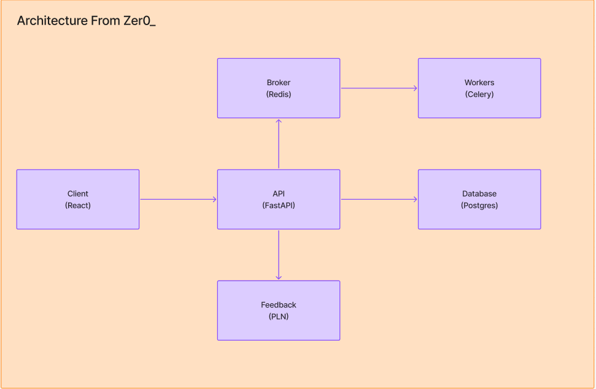

# 🤖 Sidebrain - Seu mentor para aprendizado de habilidades com IA

  

## Índice

- [📝 Descrição do Projeto](#-descrição-do-projeto)
- [📋 Product Backlog](#-product-backlog)
- [📅 Cronograma](#-cronograma)
- [🏗️ Estrutura do Projeto e Arquitetura](#️-estrutura-do-projeto-e-arquitetura)
- [⚙️ Tecnologias Utilizadas](#️-tecnologias-utilizadas)
- [📂 Documentação](#-documentação)
- [👥 Equipe](#-equipe)

---

## 📝 Descrição do Projeto
Aprender ou desenvolver uma nova habilidade exige mais do que apenas acesso a conteúdo, muitas pessoas não sabem por onde começar e nem como começar. Em casos como estudo para vestibular, redação, idiomas, desenvolvimento pessoal etc, é comum que as pessoas tenham dificuldades em identificar em que nível estão ou a definir objetivos claros e perceber se estão realmente evoluindo.

O **Sidebrain** surge dessa necessidade. Utilizando processamento de linguagem natural e Inteligência Artificial para atuar como um mentor virtual, propondo atividades personalizadas, acompanhando o progresso do usuário e oferecendo feedback de forma inteligente, gamificada e engajadora.

---

## 📋 Product Backlog

| ID | User Story | Prioridade | Sprint | Requisito |
|----|-------------|:----------:|:------:|:---------:|
| US01 | Como usuário, desejo informar meu objetivo de aprendizagem, para que o SideBrain compreenda o que desejo desenvolver. | Alta | 1 | RF01 |
| US02 | Como usuário, desejo selecionar uma área e um tema de aprendizagem, para direcionar minha jornada. | Alta | 1 | RF01, RF02 |
| US03 | Como usuário, desejo informar meu nível de conhecimento, para que as atividades sejam adequadas ao meu conhecimento. | Alta | 1 | RF03 |
| US04 | Como usuário, desejo realizar um diagnóstico inicial, para que o SideBrain identifique meu nível e minhas dificuldades. | Alta | 1 | RF02, RF03 |
| US05 | Como sistema, desejo interpretar o resultado do diagnóstico utilizando IA, para identificar conhecimentos prévios e dificuldades do usuário. | Alta | 1 | RF02, RF03, RF05 |
| US06 | Como usuário, desejo visualizar o resultado do meu diagnóstico, para compreender meu nível e minhas principais dificuldades. | Alta | 1 | RF02, RF03 |
| US07 | Como usuário, desejo receber uma jornada de aprendizagem personalizada, para estudar de acordo com meu objetivo e nível. | Alta | 1 | RF02, RF03 |
| US08 | Como usuário, desejo receber atividades e quizzes adequados ao meu nível, para desenvolver minhas habilidades. | Alta | 1 | RF03 |
| US09 | Como usuário, desejo responder às atividades e quizzes, para verificar meu conhecimento. | Alta | 1 | RF03 |
| US10 | Como usuário, desejo receber o resultado das minhas atividades, para acompanhar meu desempenho. | Alta | 1 | RF04 |
| US11 | Como usuário, desejo receber feedback personalizado sobre minhas respostas, para compreender meus erros e melhorar meu aprendizado. | Alta | 1 | RF05 |
| US12 | Como usuário, desejo informar meu objetivo de aprendizagem, para que o SideBrain compreenda o que desejo desenvolver. | Alta | 2 | RF03 |
| US13 | Como sistema, desejo identificar conteúdos ou habilidades nos quais o usuário apresenta dificuldades recorrentes, para recomendar atividades de reforço. | Alta | 2 | RF03, RF05 |
| US14 | Como sistema, desejo aumentar gradualmente o nível de desafio quando o usuário apresentar desempenho consistente, para acompanhar sua evolução. | Alta | 2 | RF03, RF04 |
| US15 | Como usuário, desejo informar que estou tendo dificuldade em determinado conteúdo, para receber uma recomendação de revisão ou reforço. | Média | 2 | RF05 |
| US16 | Como usuário, desejo visualizar meu progresso de aprendizagem, para acompanhar minha evolução ao longo da jornada. | Alta | 2 | RF04 |
| US17 | Como usuário, desejo receber XP ao concluir atividades, para tornar minha jornada mais motivadora. | Alta | 2 | RF06 |
| US18 | Como usuário, desejo evoluir meu nível de progressão conforme acumulo XP, para perceber minha evolução dentro do SideBrain. | Alta | 2 | RF06 |
| US19 | Como usuário, desejo desbloquear conquistas ao atingir determinados objetivos, para aumentar meu engajamento. | Média | 2 | RF06 |
| US20 | Como sistema, desejo manter uma memória resumida da aprendizagem do usuário, contendo objetivo, nível, dificuldades, desempenho e conteúdos estudados, para personalizar as interações sem reenviar todo o histórico à IA. | Alta | 2 | RF02, RF04, RNF07 |
| US21 | Como sistema, desejo utilizar estratégias de redução de contexto e reaproveitamento de informações, para reduzir o consumo de recursos de IA. | Alta | 2 | RNF06, RNF07, RNF09 |
| US22 | Como sistema, desejo registrar as chamadas realizadas à IA e os tokens consumidos quando disponibilizados pelo provedor, para monitorar e controlar o uso do recurso. | Média | 2 | RNF05 |
| US23 | Como sistema, desejo manter funcionalidades que não dependem de IA disponíveis quando o serviço de IA estiver indisponível ou atingir sua cota, para evitar a interrupção da aprendizagem. | Alta | 2 | RNF04 |
| US24 | Como usuário, desejo visualizar meu histórico de atividades e resultados, para acompanhar minha evolução ao longo do tempo. | Média | 3 | RF04 |
| US25 | Como usuário, desejo manter uma sequência de estudos, para incentivar a continuidade da aprendizagem. | Média | 3 | RF04, RF06 |
| US26 | Como usuário, desejo realizar desafios especiais relacionados ao meu domínio de aprendizagem, para testar minhas habilidades de forma diferenciada. | Média | 3 | RF03, RF06 |
| US27 | Como administrador, desejo cadastrar e organizar conteúdos por domínio, tema, nível e habilidade, para alimentar as jornadas de aprendizagem. | Média | 3 | RF02, RF03 |
| US28 | Como usuário, desejo selecionar diferentes áreas de aprendizagem, para estudar Ciências da Natureza, Ciências Exatas, Linguagens, Informática, Música ou Artes. | Alta | 3 | RF01, RF02 |
| US29 | Como sistema, desejo utilizar a mesma estrutura de aprendizagem independentemente do domínio selecionado, para permitir a expansão do SideBrain para novas áreas. | Alta | 3 | RF02, RF03, RNF13 |
| US30 | Como usuário, desejo fornecer materiais de estudo, como PDFs ou apostilas, para utilizar meus próprios conteúdos como base para a aprendizagem. | Média | 3 | RF02, RF03 |
| US31 | Como sistema, desejo processar materiais fornecidos pelo usuário e identificar seus principais conceitos e tópicos, para utilizá-los como contexto da jornada de aprendizagem. | Média | 3 | RF02, RF03, RNF08, RNF09 |
| US32 | Como sistema, desejo gerar explicações, questões e atividades baseadas nos materiais fornecidos pelo usuário, para personalizar ainda mais sua experiência de aprendizagem. | Média | 3 | RF03, RF05, RNF09 |
| US33 | Como sistema, desejo gerar feedback explicativo utilizando IA quando necessário, para oferecer orientações contextualizadas sobre os erros do usuário. | Média | 3 | RF05, RNF04, RNF09 |
| US33 | Como administrador, desejo visualizar métricas de utilização da IA, como quantidade de chamadas, tokens consumidos e falhas, para monitorar o consumo e identificar possíveis limitações do provedor. | Média | 3 | RNF05, RNF06 |

---

## 📅 Cronograma

| Sprint | Período | Status | Relatório |
|:------:|:-------:|:------:|:---------:|
| 1 | 07/09/2026 à 27/09/2026 | Concluído | Em breve |
| 2 | 05/10/2026 à 25/10/2026 | Concluído | Em breve |
| 3 | 02/11/2026 à 22/11/2026 | Concluído | Em breve |

---

## 🏗️ Arquitetura do sistema

---

<!-- ## ⚙️ Tecnologias Utilizadas

* **Frontend:** Flutter (Dart)
* **Backend:** Python (FastAPI / Flask)
* **Inteligência Artificial:** API da OpenAI (Modelos LLM para geração), Transformer-Encoders (para vetorização local) e Qdrant (Vector Database).
* **Infraestrutura em Nuvem:** Oracle Cloud Infrastructure (OCI).
* **Orquestração e Containers:** Kubernetes (K8s) e Docker.
* **Infraestrutura como Código (IaC):** Terraform. -->

---

## 📂 Documentação

- [Requisitos do Projeto](./docs/requisitos.md)
- [DoR e DoD](./docs/dor-dod.md)
- [Padronização de Commits](./docs/padrao-commits.md)
- [Padronização de Branches](./docs/padrao-branches.md)
- [Padronização de Pull Requests](./docs/padrao-pr.md)
- [Padronização dos releases](./docs/padrao-releases.md)

---

## 👥 Equipe

| Foto | Nome | Papel | Link para GitHub | Link para LinkedIn |
| :---: | :--- | :--- | :--- | :--- |
|  | *João Suzuki* | *Scrum Master* | *https://github.com/joaosuzuki98* | *https://www.linkedin.com/in/jo%C3%A3o-suzuki-6a2b02192/* |
|  | *Cláudio Jayme* | *Product Owner* | *https://github.com/ClaudioJaymeDiniz* | *https://www.linkedin.com/in/claudio-jayme/* |
|  | *João Góes* | *Developer* | *https://github.com/MagNumGomes* | *https://www.linkedin.com/in/joaovitorgoes* |
|  | *Davi Marinho* | *Developer* | *https://github.com/DMBMz* | *https://www.linkedin.com/in/davi-miguel-a90821214/* |
|  | *Avya Alex* | *Developer* | *https://github.com/AvyaAquino* | *https://www.linkedin.com/in/avya-candido-598b5228a/* |
|  | *Gabriel Guimarães* | *Developer* | *https://github.com/gabrielbguimaraes* | *https://www.linkedin.com/in/gabriel-g-854017138* |
|  | *Pedro Prevides* | *Developer* | *https://github.com/GalaxyBurst* | *https://www.linkedin.com/in/pedro-prevides-87a0b71a8/* |
|  | *Gabriel da Cunha* | *Developer* | *https://github.com/Tuuca* | *https://www.linkedin.com/in/gabriel-da-cunha-de-macedo-199890250/* |
|  | *Gustavo Lima* | *Developer* | *https://github.com/Miojoguu* | *https://www.linkedin.com/in/gustavo-lima-904623295/* |
